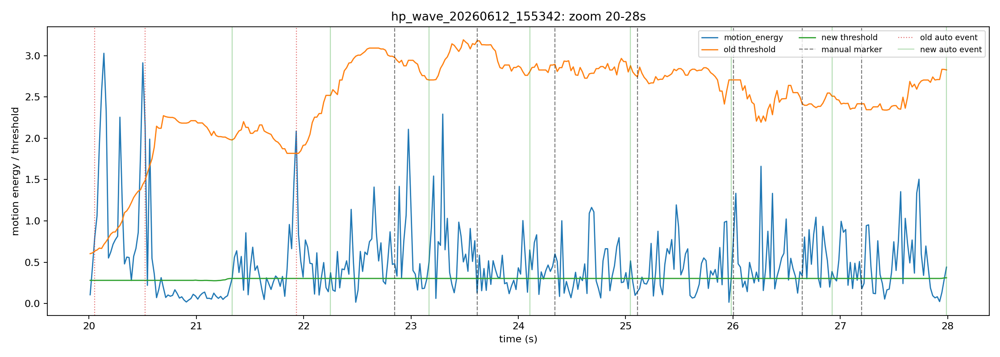
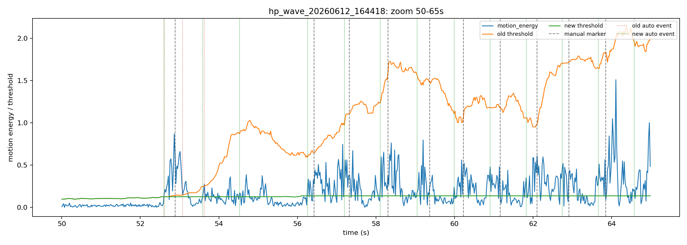
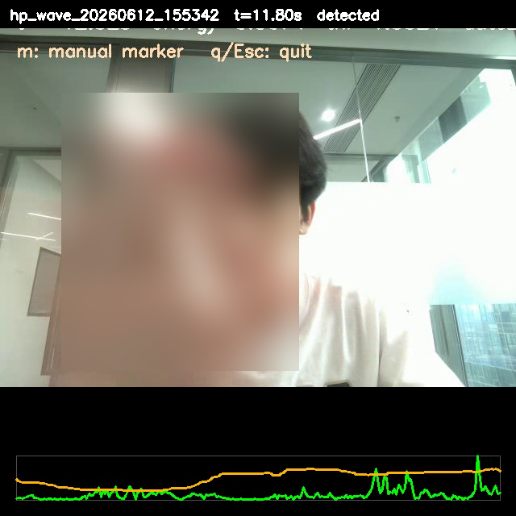
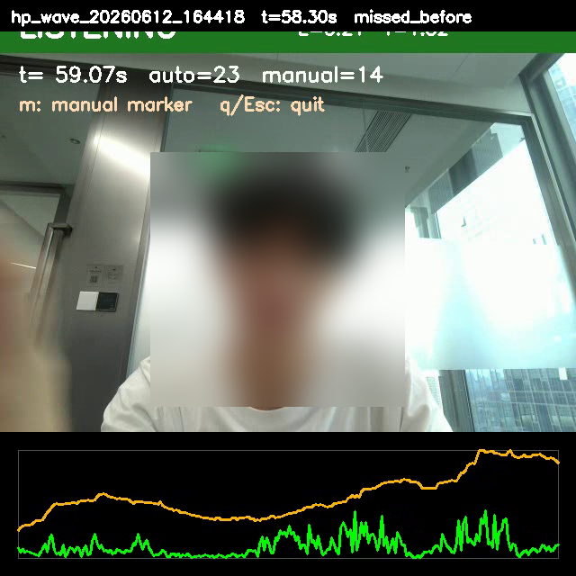
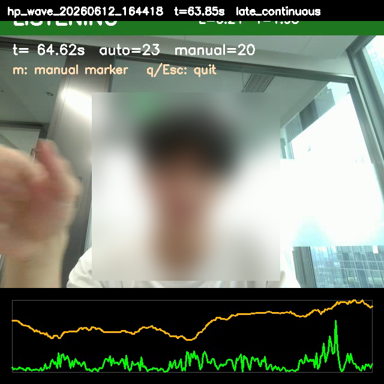

# HP 笔记本声波挥手识别原型

这个目录是一个基于 Python 的实时声波手势识别原型。它使用笔记本扬声器发出近超声单音，使用麦克风接收回波，通过 I/Q 解调得到幅度和相位变化，再用自适应阈值判断是否出现挥手等大幅动作。

当前目标不是直接识别眨眼，而是先把“声波发射 -> 麦克风采集 -> I/Q 特征 -> 动作事件”这条链路跑通。挥手动作幅度更大，适合作为眨眼识别前的第一阶段验证。

## 技术核心

### 1. 主动声学探测

程序持续播放一个单频声波，默认参数是：

| 参数 | 默认值 | 说明 |
| --- | ---: | --- |
| 采样率 | `48000 Hz` | 普通笔记本声卡可用 |
| 发射频率 | `18500 Hz` | 接近超声，减少主观听感 |
| 块大小 | `1024 samples` | 每块约 `21.3 ms` |
| 播放幅度 | `0.02` | 实验中较安全的低音量 |

当手在扬声器和麦克风附近移动时，声波传播路径、反射强度和相位会变化。程序不直接识别图像，而是检测这类声学扰动。

### 2. I/Q 解调

每个音频块都会乘以本地复指数参考信号：

```text
baseband[n] = microphone[n] * exp(-j * 2*pi*f0*n/fs)
```

然后对一个块内的 baseband 求均值，得到复数 I/Q：

```text
I = real(mean(baseband))
Q = imag(mean(baseband))
amplitude = sqrt(I^2 + Q^2)
phase = atan2(Q, I)
```

这里的 I/Q 不是简单画原始波形，而是把目标频率附近的信号搬到基带后观察幅度和相位。这个处理思路和声学感知论文中常见的“主动发声 + 接收端解调 + 观察相位/幅度扰动”一致。

### 3. 运动能量

相邻音频块之间计算：

```text
amplitude_delta = amplitude[t] - amplitude[t-1]
phase_delta = unwrap(phase[t] - phase[t-1])
relative_amp_delta = abs(amplitude_delta) / previous_amplitude
motion_energy = abs(phase_delta) + clipped(relative_amp_delta)
```

这条 `motion_energy` 不是论文中的原始公式，而是本原型为了“先检测大幅挥手动作”设计的工程启发式特征。它的理论依据来自论文中对 I/Q 空间、幅度变化和相位变化的分析：

- BlinkListener 在第 3.2 节 `Modeling the Eye Blink Process` 中从 I-Q vector space 分析眼动信号，指出路径长度变化主要带来 phase change，反射表面变化会带来 amplitude change；并进一步指出 blink-induced signal variation 具有“小相位变化、大幅度变化”的特点。
- BlinkListener 第 6.3 节 `Real-time Eye Blink Detection` 使用时域检测，而不是频域周期分析；其 Step 2 用滑动窗口中的局部极值和静止时标准差阈值检测 blink-induced bumps。
- TwinkleTwinkle 第 3.2 节 `Depict Eye Blink Motion Profile` 说明接收信号解调后得到 I/Q baseband signal；第 4.2 节使用 phase pairs / phase subtraction 提取候选 blink motion profiles。

因此，我们这里保留了“幅度扰动 + 相位扰动 + 时域事件检测”的思想，但没有复现 BlinkListener 的 viewing position / LEVD，也没有复现 TwinkleTwinkle 的 phase-pair trajectory。当前公式只是第一阶段手势原型，用于把可见的大幅声学扰动压缩成单个标量，方便实时阈值检测。

直观理解：

- 相位突变说明传播路径发生变化；
- 幅度突变说明反射强度或遮挡发生变化；
- 二者合成一个 `motion_energy`，作为检测器输入。

## 检测流程

整体流程如下：

```text
扬声器播放 18.5 kHz 单音
        |
麦克风实时采集
        |
按 1024 samples 分块
        |
I/Q 解调
        |
计算 amplitude / phase / motion_energy
        |
滚动 median + MAD 建立静止 baseline
        |
motion_energy > threshold 时触发 WAVE DETECTED
        |
保存 audio.wav / features.csv / events.csv / camera.mp4 / metadata.json
```

检测器使用滚动 median/MAD：

```text
baseline = median(history)
mad = median(abs(history - baseline))
threshold = max(min_energy, baseline + threshold_k * 1.4826 * mad)
```

当前默认参数：

| 参数 | 默认值 | 作用 |
| --- | ---: | --- |
| `history_size` | `120` | baseline 历史窗口 |
| `min_history` | `20` | 至少积累多少块后开始检测 |
| `threshold_k` | `8.0` | MAD 阈值倍数 |
| `min_energy` | `0.015` | 最小阈值 |
| `refractory_s` | `0.9` | 两次事件之间的最小间隔 |
| `baseline_freeze_s` | `1.0` | 事件后冻结 baseline 的时间 |
| `detection_hold_s` | `2.0` | UI 红色提示保持时间 |

### Baseline 防污染

实验中发现，如果把挥手期间的高能量也写入 baseline，连续挥手会把阈值抬高，导致后续动作漏检。因此当前检测器做了两层保护：

1. `motion_energy > threshold` 的样本不进入 baseline history。
2. 事件触发后 `baseline_freeze_s = 1.0s` 内不更新 baseline。

这个策略会增加一些误报，但能显著减少漏检。当前阶段更适合“先把动作采全”，之后再通过事件分组和更严格的分类器减少误报。

## 如何使用

先进入本目录，后续命令不再依赖根目录下的 `scripts` 目录：

```powershell
cd E:\android_projects\eye_blink_detect\hp_acoustic_wave
```

安装依赖：

```powershell
& 'C:\Program Files\Python38\python.exe' -m pip install -r requirements_hp_acoustic_wave.txt
```

启动实时检测：

```powershell
& 'C:\Program Files\Python38\python.exe' .\run_hp_wave_detector.py --session-root sessions --frequency 18500 --amplitude 0.02 --camera-width 640 --camera-height 480
```

如果要试 FMCW chirp 版挥手检测：

```powershell
& 'C:\Program Files\Python38\python.exe' .\run_hp_wave_detector.py --mode wave --signal-mode fmcw --fmcw-range-bin 15 --amplitude 0.2 --input-device 1 --output-device 3 --camera-width 640 --camera-height 480
```

这条路径会把发声从单频 `18.5 kHz` 换成 `17-23 kHz` FMCW chirp，每个 `0.05s` chirp 提取一次指定 `range_bin` 的 I/Q、幅度、相位和 `motion_energy`，然后继续复用原来的自适应阈值挥手检测器。`motion_energy` 的相对幅度项有默认 `0.02` 的幅度下限，避免启动阶段的近零幅度噪声污染 baseline。

如果指定 bin 不明显，可以参考 `refer\FMCW\README.md` 先试 `10-25` 附近的几个 bin；如果需要调 FMCW 相对幅度敏感度，可以改：

```powershell
--fmcw-motion-amplitude-floor 0.02
```

运行后会打开摄像头窗口：

- 绿色 `LISTENING`：当前未检测到挥手；
- 红色 `WAVE DETECTED`：检测到声学动作事件；
- 按 `m`：保存一个人工标注点；
- 按 `q` 或 Esc：退出并保存数据。

## 眨眼检测模式

当前 Python 版本已经保留挥手检测，同时新增了一个实时眨眼候选检测模式。默认仍使用 HP 笔记本的单频声波链路；如果加上 `--signal-mode fmcw`，TwinkleTwinkle 路线会改用选中 range-bin 的 FMCW 相位差轨迹。BlinkListener 路线则实现了更接近论文核心的 I/Q viewing-position bump 检测。

启动 BlinkListener 路线：

```powershell
& 'C:\Program Files\Python38\python.exe' .\run_hp_wave_detector.py --mode blink --blink-method blinklistener --session-root sessions --frequency 18500 --amplitude 0.02 --camera-width 640 --camera-height 480
```

启动 TwinkleTwinkle 路线：

```powershell
& 'C:\Program Files\Python38\python.exe' .\run_hp_wave_detector.py --mode blink --session-root sessions --frequency 18500 --amplitude 0.02 --camera-width 640 --camera-height 480
```

启动 FMCW + TwinkleTwinkle 眨眼试验路径：

```powershell
& 'C:\Program Files\Python38\python.exe' .\run_hp_wave_detector.py --mode blink --blink-method twinkle --signal-mode fmcw --fmcw-range-bin 15 --amplitude 0.2 --input-device 1 --output-device 3 --camera-width 640 --camera-height 480
```

这条路径使用选中 FMCW `range_bin` 的相位作为 Twinkle phase-pair 轨迹来源，并在相信相位前检查该 bin 的幅度下限和幅度稳定性，避免把低幅度噪声 bin 当成眨眼。可调参数：

```powershell
--blink-twinkle-fmcw-min-amplitude 0.0001
--blink-twinkle-fmcw-phase-pair-weight 0.5
--blink-twinkle-fmcw-max-amplitude-delta-ratio 0.45
--blink-twinkle-fmcw-min-score 0.07
--blink-twinkle-fmcw-refractory 1.3
```

如果误检仍多，优先提高 `--blink-twinkle-fmcw-min-score`；如果连续重复触发多，优先提高 `--blink-twinkle-fmcw-refractory`。

### 视觉眨眼真值标注

在 `--mode blink` 且摄像头开启时，程序会自动尝试启用 MediaPipe FaceMesh + EAR 视觉眨眼检测，用它作为声学眨眼实验的真值标注。也就是说：

- 声学算法输出的是 `blink_candidate`，表示“声学信号里疑似出现眨眼”；
- 视觉算法输出的是 `visual_blink`，表示“摄像头里确认发生了一次眨眼”；
- 后续分析时用两者的 `time_s` 对齐，判断声学 I/Q、相位轨迹和候选事件是否真的对应眨眼。

你现在这条命令默认就会开启视觉标注：

```powershell
& 'C:\Program Files\Python38\python.exe' .\run_hp_wave_detector.py --mode blink --blink-method twinkle --signal-mode fmcw --fmcw-range-bin 15 --amplitude 0.2 --input-device 1 --output-device 3 --camera-width 640 --camera-height 480
```

运行窗口底部会显示类似：

```text
vision: open EAR=0.286 truth=3
vision: closed EAR=0.174 truth=3
vision: open EAR=0.291 truth=4 VISUAL BLINK
```

含义如下：

| 显示项 | 说明 |
| --- | --- |
| `open/closed` | 当前视觉判断眼睛是否闭合 |
| `EAR` | 左右眼 EAR 平均值，越低表示眼睛越闭合 |
| `truth` | 视觉确认的眨眼累计次数 |
| `VISUAL BLINK` | 刚刚确认了一次视觉眨眼真值 |

默认视觉参数：

| 参数 | 默认值 | 说明 |
| --- | ---: | --- |
| `--visual-ear-threshold` | `0.22` | EAR 低于该值认为闭眼 |
| `--visual-consecutive-frames` | `3` | 连续闭眼帧数达到该值，睁眼释放时记一次眨眼 |
| `--visual-min-detection-confidence` | `0.5` | MediaPipe 人脸检测置信度 |
| `--visual-min-tracking-confidence` | `0.5` | MediaPipe 跟踪置信度 |

如果视觉误标太多，可以先调低/调高 `--visual-ear-threshold`。例如眼睛较小、睁眼 EAR 本来就低时，阈值可试 `0.18-0.20`；如果闭眼不容易触发，可试 `0.24`。如果暂时只想采声学数据，不写视觉真值：

```powershell
--no-visual-labels
```

每次 session 会额外生成 `visual_labels.csv`，每一行对应一次摄像头帧的视觉状态：

| 字段 | 说明 |
| --- | --- |
| `time_s` | 从本次运行开始计时的视觉帧时间 |
| `face_present` | 是否检测到人脸 |
| `left_ear`, `right_ear`, `mean_ear` | 左眼、右眼、平均 EAR |
| `is_closed` | 当前帧是否闭眼 |
| `closed_frames` | 当前连续闭眼帧数 |
| `is_blink_event` | 这一帧是否确认了一次视觉眨眼 |
| `blink_count` | 视觉眨眼累计次数 |

同时，`events.csv` 会同时包含两类事件：

| `label` | 来源 | 用法 |
| --- | --- | --- |
| `blink_candidate` | 声学 Twinkle/BlinkListener 检测器 | 待验证的声学候选 |
| `visual_blink` | MediaPipe EAR 视觉检测 | 作为真值标注 |

推荐的分析方法是：先筛出 `events.csv` 中的 `visual_blink`，再看它前后 `+-0.5s` 到 `+-0.8s` 内有没有 `blink_candidate`，并回看 `features.csv` 里的 `i/q/phase/twinkle_*` 曲线。如果视觉眨眼附近的 I/Q 轨迹有稳定形态，说明当前 range bin 和算法方向可继续调参；如果视觉眨眼附近没有明显声学响应，优先换 `--fmcw-range-bin`、调整设备距离或提高声学发射幅度。

同时运行两条路线并选择当前更强的候选：

```powershell
& 'C:\Program Files\Python38\python.exe' .\run_hp_wave_detector.py --mode blink --blink-method both --session-root sessions --frequency 18500 --amplitude 0.02 --camera-width 640 --camera-height 480
```

眨眼模式下，窗口会显示 `BLINK CANDIDATE`、当前算法名、score 和 threshold。按键含义：

- `b`：标注一次真实眨眼；
- `w`：标注一次大幅动作或干扰；
- `m`：普通人工标记；
- `q` 或 Esc：退出并保存数据。

新增输出列会写入 `features.csv`，包括 `detector_method`、`blink_score`、`blink_threshold`、`blinklistener_viewing_amplitude`、`blinklistener_relative_viewing_score`、`blinklistener_center_i/q`、`twinkle_phase_pair_delta`、`twinkle_trajectory_span`、`twinkle_trajectory_rms` 等。`manual_markers.csv` 会保存按键、标签和当时的 amplitude/phase/motion_energy 快照，方便后续离线回看。

基于 `sessions/hp_blink_20260612_192223` 的标注回放，当前 blink 默认值偏向 TwinkleTwinkle 代理方法：

| 参数 | 默认值 | 说明 |
| --- | ---: | --- |
| `--blink-method` | `twinkle` | 当前 HP 单音数据上比 BlinkListener 路线更可靠 |
| `--blink-threshold-k` | `2.5` | 比第一版更敏感，提升轻微眨眼召回 |
| `--blink-startup-ignore` | `2.0` | 忽略启动初期声卡/声场稳定过程；当前标注数据中 3s 后已有有效眨眼 |
| `--blink-release-ratio` | `0.4` | score 回落到阈值的 40% 后才允许再次触发 |
| `--blink-phase-step-floor` | `0.015` | Twinkle 相位轨迹方向变化的最小步长 |

同一组数据上，新默认参数从第一版的 `6/15` 个 blink 标注命中，提升到 `10/15`，自动事件从 `25` 个降到 `16` 个。剩余漏检主要集中在 10-13 秒附近的极轻微眨眼，后续需要更多标注数据继续调参或引入更细的局部候选评分。

在标注更密集的 `sessions/hp_blink_20260612_193944` 上，当前默认 Twinkle 路线命中 `16/37` 个 blink 标注，`both` 路线同样命中 `16/37`。这说明当前 HP 单音实现仍主要由 Twinkle 相位轨迹代理方法贡献；BlinkListener 路线已经改为相对 viewing-position bump，避免被笔记本真实 I/Q 幅值量级压死，但单独召回仍较低。该组实验输出位于 `docs/experiments/acoustic_blink_20260612_193944/`。

如果要离线回放已有 session 并评估眨眼标注，可以运行同目录下的评估脚本：

```powershell
& 'C:\Program Files\Python38\python.exe' .\benchmark_hp_blink.py --session sessions\hp_blink_20260612_193944 --source features
```

## 选择麦克风和喇叭

列出当前设备：

```powershell
$env:PYTHONIOENCODING='utf-8'
@'
import sounddevice as sd

print("Default device [input, output]:", sd.default.device)
print()
print(sd.query_devices())
'@ | & 'C:\Program Files\Python38\python.exe' -
```

输出中：

- `>` 是默认输入麦克风；
- `<` 是默认输出喇叭；
- `(2 in, 0 out)` 表示输入设备；
- `(0 in, 2 out)` 表示输出设备。

如果要显式指定设备：

```powershell
& 'C:\Program Files\Python38\python.exe' .\run_hp_wave_detector.py --session-root sessions --frequency 18500 --amplitude 0.02 --input-device 1 --output-device 3 --camera-width 640 --camera-height 480
```

程序启动时会打印实际使用的设备，例如：

```text
Audio devices:
  input : [1] 麦克风阵列 (...) (MME, in=2, out=0)
  output: [3] 扬声器 (...) (MME, in=0, out=8)
```

同样的信息也会写入 `metadata.json` 的 `audio_devices` 字段。

## 输出数据

每次运行会创建一个 session 目录：

```text
sessions/hp_wave_YYYYMMDD_HHMMSS/
sessions/hp_blink_YYYYMMDD_HHMMSS/
```

目录内容：

| 文件 | 说明 |
| --- | --- |
| `audio.wav` | 麦克风原始录音 |
| `features.csv` | 每个音频块的 I/Q、幅度、相位、能量、阈值 |
| `events.csv` | 自动检测到的声学事件 |
| `manual_markers.csv` | 用户按 `m` 记录的人工标注 |
| `visual_labels.csv` | 摄像头 EAR 视觉眨眼真值，每个摄像头帧一行 |
| `camera.mp4` | 摄像头画面和实时检测状态叠加 |
| `metadata.json` | 参数、设备、平台、事件数量等元数据 |

`features.csv` 中最重要的列：

| 字段 | 说明 |
| --- | --- |
| `time_s` | 音频时间戳 |
| `i`, `q` | I/Q 基带均值 |
| `amplitude` | 当前块目标频率幅度 |
| `phase` | 当前块相位 |
| `amplitude_delta` | 相邻块幅度变化 |
| `phase_delta` | 相邻块相位变化 |
| `motion_energy` | 检测器输入能量 |
| `baseline`, `mad`, `threshold` | 自适应阈值状态 |
| `is_event`, `event_id` | 是否触发自动事件 |
| `signal_mode` | `tone` 或 `fmcw` |
| `range_bin`, `range_distance_m` | FMCW 模式下当前使用的 range bin 和对应距离 |
| `visual_mean_ear` | 最近一次视觉帧的平均 EAR |
| `visual_blink_event` | 最近一次视觉帧是否确认眨眼 |
| `visual_blink_count` | 视觉真值眨眼累计次数 |

## 标注数据和实验结果

目前整理了两条有人工标注的数据：

| Session | 时长 | 人工标注 |
| --- | ---: | ---: |
| `hp_wave_20260612_155342` | 42.05 s | 11 |
| `hp_wave_20260612_164418` | 73.11 s | 22 |

实验结果位于：

```text
docs/experiments/acoustic_wave_20260612/
```

包含：

- `summary_metrics.csv`
- `analysis_summary.json`
- 每条 session 的 marker 对齐明细 CSV
- 能量/阈值曲线图
- 从视频抽出的模糊脸部截图

### 检测器改进前后对比

自动事件和人工标注使用 `+-0.8s` 匹配窗口：

| Session | 旧算法事件数 | 旧算法命中 | 旧算法漏检 | 旧算法误报 | 当前算法事件数 | 当前算法命中 | 当前算法漏检 | 当前算法误报 |
| --- | ---: | ---: | ---: | ---: | ---: | ---: | ---: | ---: |
| `hp_wave_20260612_155342` | 12 | 3 / 11 | 8 | 6 | 21 | 11 / 11 | 0 | 9 |
| `hp_wave_20260612_164418` | 27 | 12 / 22 | 10 | 6 | 38 | 22 / 22 | 0 | 11 |

主要结论：

- 当前算法在这两条数据上覆盖了所有人工标注；
- 漏检从 `18` 次降到 `0` 次；
- 误报从 `12` 次增加到 `20` 次；
- 这说明 baseline 防污染策略有效，但下一步需要做事件分组或更严格分类来压误报。

### 结果图表

`hp_wave_20260612_155342` 全局曲线：


`hp_wave_20260612_155342` 局部放大：



`hp_wave_20260612_164418` 全局曲线：


`hp_wave_20260612_164418` 的 `50s - 65s` 连续挥手段最能说明问题：



图中：

- 蓝线：`motion_energy`
- 橙线：旧算法保存时的阈值
- 绿线：当前算法回放时的新阈值
- 灰色虚线：人工标注
- 红色虚线：旧算法自动事件
- 绿色竖线：当前算法自动事件

可以看到旧阈值在连续挥手时被抬到很高，后续动作虽然有声学能量，但无法越过阈值；当前算法阻止动作能量进入 baseline，因此阈值保持较稳定。

### 视频截图

截图来自 `camera.mp4`，已对脸部区域做模糊处理。

`hp_wave_20260612_155342`：




`hp_wave_20260612_164418`：






### 关键实验观察

`hp_wave_20260612_164418` 中，旧算法在 `56s - 64s` 连续挥手段漏掉了大量标注：

| 人工标注 | 标注附近最大能量 | 旧阈值 | 旧结果 |
| ---: | ---: | ---: | --- |
| 56.427 s | 0.532 | 0.811 | 漏检 |
| 57.323 s | 0.745 | 0.974 | 漏检 |
| 58.304 s | 0.763 | 1.691 | 漏检 |
| 59.371 s | 0.797 | 1.448 | 漏检 |
| 60.224 s | 0.561 | 1.004 | 漏检 |
| 61.163 s | 0.483 | 1.182 | 漏检 |
| 62.101 s | 0.610 | 0.983 | 漏检 |
| 62.912 s | 0.520 | 1.705 | 漏检 |
| 63.851 s | 1.510 | 2.005 | 漏检 |

这些点证明：声学响应存在，但 baseline 被动作污染后，阈值漂移得过高。

## 当前限制

1. 当前识别的是“大幅手势动作”，不是眨眼。
2. 近超声频率在不同笔记本、不同喇叭/麦克风组合上响应会变化。
3. 当前阈值策略偏向高召回，会带来更多自动事件。
4. 连续动作时，一个真实挥手可能被拆成多个自动事件。
5. 摄像头打开速度在这台 HP 上有时较慢。

## 下一步建议

1. 继续采集更多标注数据，每条包含静止、单次挥手、连续挥手。
2. 增加离线评估脚本，自动批量输出命中、漏检、误报。
3. 增加事件分组，把连续多个自动事件合并成一个 gesture interval。
4. 比较不同设备组合和频率，例如 `18 kHz`, `18.5 kHz`, `19 kHz`。
5. 在挥手稳定后，再迁移到更小幅度的眨眼动作识别。
